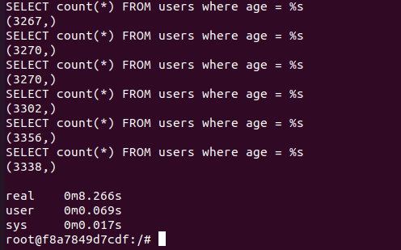
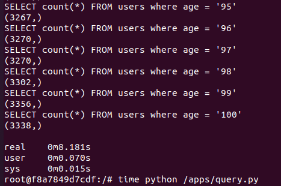

# Laboratório 04 Otimização de Banco de Dados

## Setup

Este projeto foi construído utilizando

- Linux
- Docker
- Mysql 8.0.27
- Python 3.8

## Executando

### Suba os containers

```bash
docker-compose up
```

### Popule o banco de dados

```bash
make populate
```

### Execute as consultas

Executando com Prepared Statement

```bash
export IS_PREPARED=1
make query
```

Executando com Prepared Statement

```bash
unset IS_PREPARED
make query
```

## Resultados

Com Prepared Statement



Sem Prepared Statement



O campo `real` mostra o tempo total de execução do Script.
